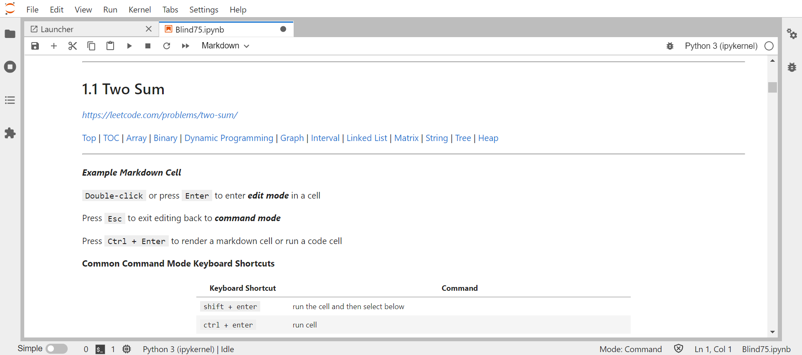

# Leetcode "Blind 75" Jupyter Template

---

# Description

All-in-one tracking, notes, and code testing notebook for working through "Blind 75" Leetcode problems.

Take notes and work problems in python. Check off as you complete.

***This is only a template for notes and coding. There are no solved problems here.***

**Blind 75 Discussion:** *https://leetcode.com/discuss/general-discussion/460599/blind-75-leetcode-questions*

**Coding Patterns:** *https://hackernoon.com/14-patterns-to-ace-any-coding-interview-question-c5bb3357f6ed*

---

# How to start using Jupyter notebooks 

- What is a Jupyter Notebook?
    - Free, open-source tool to conveniently take notes and run python code snippets in one place
    - Watch the first few minutes of this [tutorial](https://www.youtube.com/watch?v=HW29067qVWk) to get a general idea.
- How do I get it?
    - Here are some suggestions (there are a ton of options and tutorials online) - ***Choose your preferred method***
        - [Jupyter Official](https://jupyter.org/install) - install from command line with Python's package manager `pip`:
            - Open terminal or powershell and use the following commands: 
            - `pip -V` and `python3 -V` - checks package manager and python versions
                - Linux/Unix/MacOS: should come preinstalled with some version of Python
                - Windows: if not already installed, download and install from [python.org](https://www.python.org/downloads/)
                    - ***Note***: check the "add to PATH" box during install to allow for command-line operation
            - `pip install jupyter` - installs jupyter and required dependencies
            - `jupyter-lab` - Launches Jupyter Lab in default browser
            - `jupyter notebook` - Launches the classic Jupyter Notebook
        - [Anaconda](https://www.anaconda.com/) - Open-source toolkit with Jupyter included
        - [Visual Studio Code](https://code.visualstudio.com/Download)
            - In vscode, bring up extensions with `ctrl+shift+x` then type "Jupyter"
            - Click on the Jupyter extension from Microsoft, then click install
            - See this [vscode doc on using Jupyter](https://code.visualstudio.com/docs/datascience/jupyter-notebooks)

---

# Template overview

- **Navagation links** are in regular text and navigate to different sections in this notebook through HTML anchors.
    - e.g. <a href='#toc'>Table of Contents</a> would take you to that section of the notebook
- **External website links** are in *italic text* and navigate to external websites.
    - e.g. *https://www.leetcode.com*
- **Checkboxes** are updated by `double-click` or pressing `Enter` in a cell and changing:
    - `<input type="checkbox">` = Unchecked (<input type="checkbox">)
    - `<input type="checkbox" checked>` = Checked (<input type="checkbox" checked>)

 

